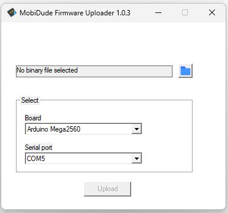

# AVR Firmware Uploader

December 01 2023 - v1.0.3

Yes, it's just a simple GUI for avrdude and ESP32tool.

It is based on https://github.com/maddsua/arduinouploader

Features:
- Upload firmware files by just defining your Arduino Board and selecting the firmware file
- Sometimes the ProMicro gets a time out from AVRDude. In this case just start again flashing
- ESP32 must **not** be in bootloader mode for now

## List of arduino boards
- Arduino Mega2560
- ProMicro
- Uno
- Nano (with old and new bootloader)
- Mini
- Pro/Mini (with separate USB adapter)
- ESP32-S2-mini

## Erase EEPROM
For the above mentioned boards also an erase EEPROM .hex file is included.
Choose the file according your board.
If you upload this firmware, the existing firmware and the eeprom content will be erased.
Afterwords upload your firmware file again.

With version 1.0.2 of the EEPROM clear hex files the build in LED of the Arduinos will blink after clearing the EEPROM

---

### This package includes next open-source binaries:

 - avrdude 6.3.0 which is included in the download file under build-win
 - ESP32 tool and python package from platformIO

Just download the zip package, extract it in an own folder and run MobiDude.exe

[Download package 📦](build-win/MobiDude-1.0.3.zip)
