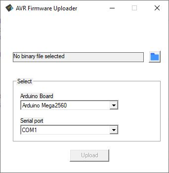

# AVR Firmware Uploader

July 27 2022 - v1.0.0

Yes, it's just a simple GUI for avrdude.

It is based on https://github.com/maddsua/arduinouploader

Features:
- Upload firmware files by just defining your Arduino Board and selecting the firmware file

## List of arduino boards
- Arduino Mega2560
- ProMicro
- Uno
- Nano (with old and new bootloader)
- Mini
- Pro/Mini (with separate USB adapter)

---

### This package includes next open-source binaries:

 - avrdude 6.3.0 which is included in the download file under build-win

Just download the zip package, extract it in an own folder and run MobiDude.exe

[Download package 📦](build-win/MobiDude-1.0.0.zip)
